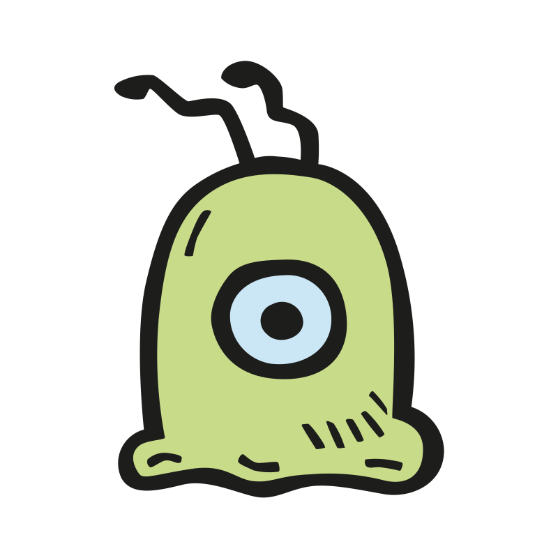
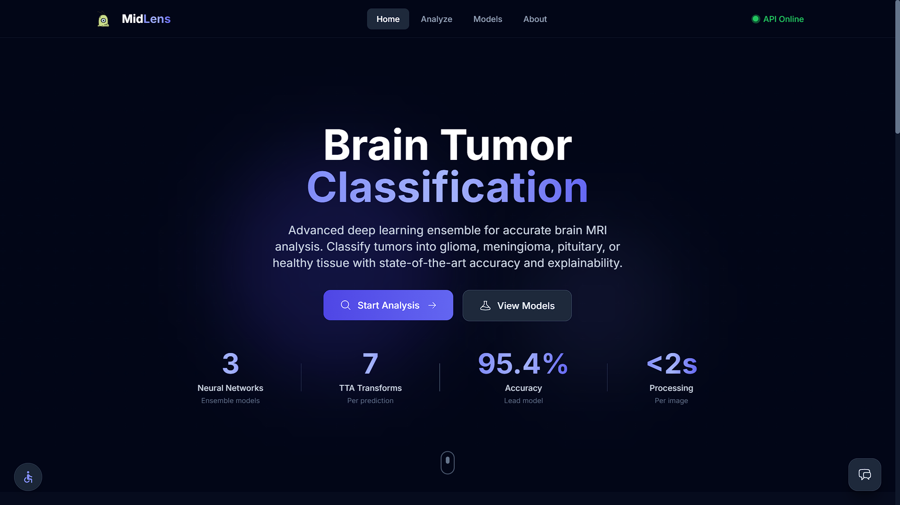
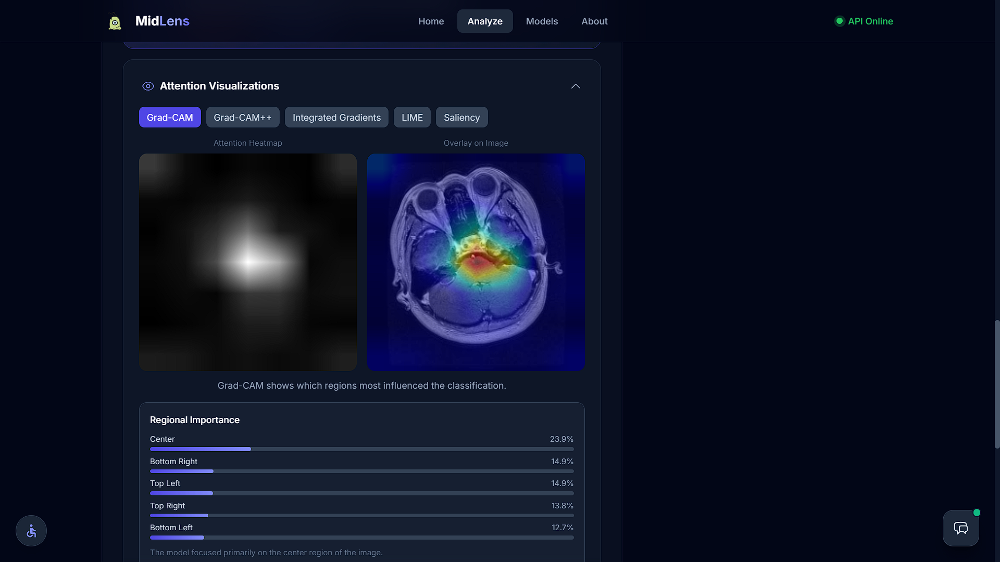
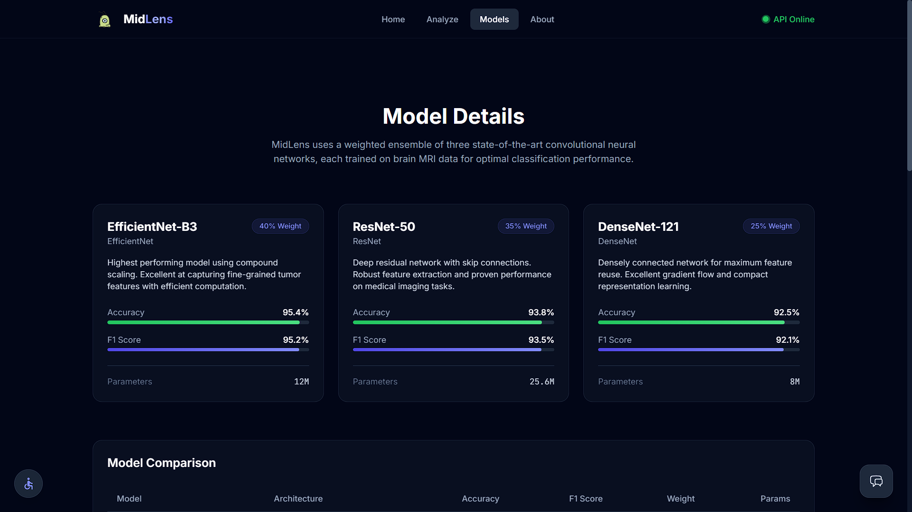

<p align="center">
  
</p>

<h1 align="center">MidLens</h1>

<p align="center">
  <strong>Brain tumor classification from MRI scans using deep learning</strong>
</p>

<p align="center">
  
  
  
  
  
  
</p>

---

## What is MidLens?

MidLens is a full-stack application that classifies brain MRI scans into four categories — **glioma**, **meningioma**, **pituitary tumor**, and **no tumor** — using a weighted ensemble of three convolutional neural networks. The system provides multi-method explainability, an agentic RAG chatbot for medical Q&A, and a modern React frontend.

---

## Screenshots

<p align="center">
  
</p>
<p align="center"><em>Home — Brain Tumor Classification hero with live ensemble stats</em></p>

<br />

<p align="center">
  
</p>
<p align="center"><em>Analyze — Grad-CAM attention heatmap with regional importance breakdown</em></p>

<br />

<p align="center">
  
</p>
<p align="center"><em>Models — EfficientNet-B3, ResNet-50, and DenseNet-121 ensemble details</em></p>

---

## Features

| Feature | Description |
|---|---|
| **3-Model Ensemble** | EfficientNet-B3, ResNet-50, and DenseNet-121 combined with F1-optimized weights |
| **Test-Time Augmentation** | 7 augmentations per model (flips, rotations, center crop) for robust predictions |
| **Temperature Scaling** | Per-model calibration for reliable confidence scores |
| **Multi-Method XAI** | Grad-CAM/Grad-CAM++, Integrated Gradients, Saliency Maps, LIME |
| **Agentic RAG Chatbot** | Sentence-transformer embeddings with FAISS search, multi-LLM fallback (Gemini/Groq) |
| **CLAHE Preprocessing** | Contrast-limited adaptive histogram equalization for enhanced MRI input |
| **Accessibility** | WCAG 2.1 AA — keyboard navigation, screen-reader support, high-contrast mode |

---

## Model Performance

| Model | Accuracy | F1 Score | Ensemble Weight | Parameters |
|---|---|---|---|---|
| EfficientNet-B3 | 95.4% | 95.2% | 40% | 12M |
| ResNet-50 | 93.8% | 93.5% | 35% | 25.6M |
| DenseNet-121 | 92.5% | 92.1% | 25% | 8M |

Weights derived from validation F1 scores. Temperature scaling values: 1.15, 1.22, 1.28 respectively.

---

## Project Structure

```
MidLens/
├── run.py                         # Entry point (waitress / Flask dev server)
├── server/                        # Backend Python package
│   ├── __init__.py
│   ├── app.py                     #   Flask app factory & API routes
│   ├── config.py                  #   Class metadata, ensemble weights, settings
│   ├── classifier.py              #   TumorClassifier, ImagePreprocessor, TTA
│   ├── explainability.py          #   XAI engine (Grad-CAM, IG, Saliency, LIME)
│   └── chatbot/                   #   AI chatbot package
│       ├── __init__.py
│       ├── agent.py               #     Agentic RAG (primary)
│       ├── fallback.py            #     Multi-LLM fallback
│       ├── llm_client.py          #     Gemini / Groq API client
│       └── rate_limiter.py        #     Rolling-window rate limiter
├── models/                        # Trained weights (.pth)
│   ├── best_efficientnet_b3.pth
│   ├── best_resnet50.pth
│   └── best_densenet121.pth
├── knowledge_base/
│   └── medical_knowledge.json     # RAG knowledge base
├── frontend/                      # React 18 + TypeScript + Vite + Tailwind
│   ├── src/
│   │   ├── pages/                 #   Home, Analyze, Models, About
│   │   ├── components/
│   │   │   ├── ui/                #   Reusable UI primitives
│   │   │   ├── layout/            #   Header, Footer
│   │   │   └── features/          #   Chatbot, ModelCard, FeatureGrid, etc.
│   │   ├── context/               #   React context providers
│   │   ├── hooks/                 #   Custom hooks
│   │   ├── services/              #   API service layer
│   │   ├── types/                 #   TypeScript type definitions
│   │   └── utils/                 #   Constants, helpers
│   ├── vite.config.ts
│   └── package.json
├── data/                          # Dataset (git-ignored)
├── pyproject.toml                 # Project metadata & Ruff config
├── requirements.txt               # Python dependencies
├── .env.example                   # Environment variable template
├── LICENSE                        # MIT License
└── README.md
```

---

## Quick Start

### Prerequisites

- Python ≥ 3.10
- Node.js ≥ 18 & npm
- CUDA GPU recommended (CPU fallback supported)

### 1 — Install dependencies

```bash
git clone https://github.com/TheManishCode/brain-tumor-xAI.git
cd brain-tumor-xAI

# Python
python -m venv .venv
.venv\Scripts\activate            # Windows
# source .venv/bin/activate       # macOS / Linux
pip install -r requirements.txt

# Frontend
cd frontend && npm install && cd ..
```

### 2 — Configure environment

```bash
copy .env.example .env            # Windows
# cp .env.example .env            # macOS / Linux
```

Add your API keys in `.env` (optional — the chatbot degrades gracefully without them):

```
GEMINI_API_KEY=your_key_here
GROQ_API_KEY=your_key_here
```

### 3 — Run

**Backend** (Terminal 1):

```bash
python run.py                     # production (waitress, 4 threads)
python run.py --debug             # development (Flask hot-reload)
```

**Frontend** (Terminal 2):

```bash
cd frontend
npm run dev
```

| Service | URL |
|---|---|
| Backend API | http://localhost:5000 |
| Frontend | http://localhost:5173 |

---

## API Endpoints

| Method | Endpoint | Description |
|---|---|---|
| `GET` | `/api/health` | Health check — loaded models, device info |
| `POST` | `/api/predict` | Classify an MRI image (multipart `file`) |
| `POST` | `/api/explain` | Quick Grad-CAM explanation |
| `POST` | `/api/analyze` | Full analysis with multi-method XAI |
| `POST` | `/api/chat` | AI chatbot — `{"message": "..."}` |
| `POST` | `/api/chat/suggestions` | Context-aware suggested questions |
| `POST` | `/api/chat/clear` | Clear chat session |
| `GET` | `/api/chat/status` | Chatbot & LLM provider status |

---

## How the Ensemble Works

1. **Preprocessing** — Input MRI is resized to 224×224, enhanced with CLAHE, converted to 3-channel RGB, and normalized with ImageNet statistics.
2. **Test-Time Augmentation** — Each model runs 7 transforms: original, horizontal flip, vertical flip, center crop (256→224), and rotations at 90°, 180°, 270°. Predictions are averaged.
3. **Weighted Voting** — Model outputs are combined using F1-derived weights (40/35/25%).
4. **Temperature Scaling** — Per-model temperature values (1.15, 1.22, 1.28) calibrate raw logits into reliable confidence scores.
5. **Explainability** — Grad-CAM heatmaps highlight which regions influenced the decision.

---

## Tech Stack

| Layer | Technologies |
|---|---|
| **ML / Backend** | PyTorch, torchvision, Flask, OpenCV, scikit-learn, sentence-transformers |
| **Explainability** | Grad-CAM++, Integrated Gradients, Saliency Maps, LIME |
| **Chatbot** | Agentic RAG, sentence-transformers, Gemini / Groq LLM, PubMed & web search |
| **Frontend** | React 18, TypeScript, Vite, Tailwind CSS, Framer Motion |

---

## Dataset

The models were trained on the [Brain Tumor MRI Dataset](https://www.kaggle.com/datasets/masoudnickparvar/brain-tumor-mri-dataset):

| Property | Value |
|---|---|
| Total images | 7,023 |
| Classes | Glioma, Meningioma, Pituitary, No Tumor |
| Input size | 224 × 224 px |
| Color mode | RGB (converted from grayscale via CLAHE) |
| Split | 80 / 10 / 10 (train / val / test) |

---

## Disclaimer

> **This application is for research and educational purposes only.** It is not intended for clinical diagnosis or medical decision-making. Always consult qualified healthcare professionals for medical advice.

---

## License

[MIT](LICENSE)
